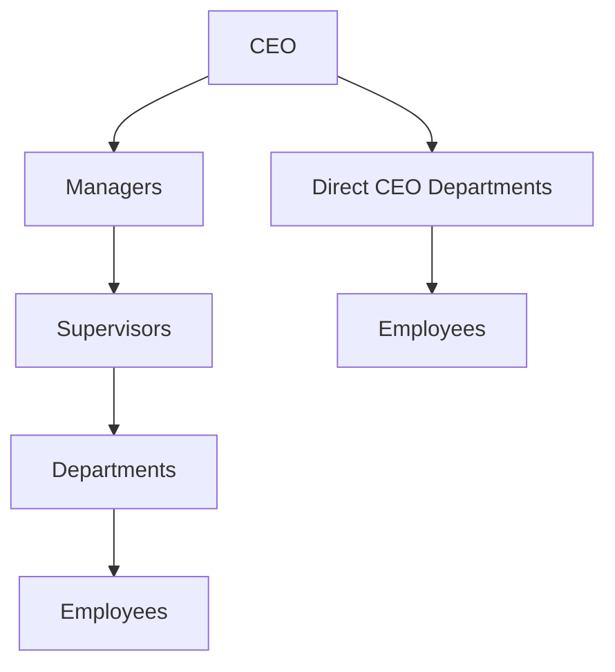

# Organization Compliance Upgrade Plan

## Problem Frame

The current module has the right foundation: `Department`, `OrgUnit`, `Employee.departmentId`, an onboarding department dropdown, and an ECharts org chart. To satisfy the client’s compliance requirement, we should make the module explicitly maintain a complete hierarchy:

Scope: improve org governance, chart completeness, setup UX, and employee edit department assignment. Do not replace the existing ATS employee model; continue using `Employee.departmentId` as the source for placing employees under department nodes.

## Current Code To Build On

- Backend org model: `uat.dharwin.backend/src/models/orgUnit.model.js`
  - Supports `type`, `parentId`, `headEmployeeId`, `departmentId`, `directToCeo`, `order`, `isActive`.
- Backend tree builder: `uat.dharwin.backend/src/services/orgTree.pure.js`
  - Buckets active employees into department nodes by `departmentId` and sends unmatched employees to `unassigned`.
- Backend update path: `uat.dharwin.backend/src/services/employee.service.js`
  - `updateCandidateById` already accepts `departmentId` and calls `setEmployeeDepartment`.
- Frontend org pages:
  - `uat.dharwin.frontend/app/(components)/(contentlayout)/organization/chart/page.tsx`
  - `uat.dharwin.frontend/app/(components)/(contentlayout)/organization/structure/page.tsx`
  - `uat.dharwin.frontend/app/(components)/(contentlayout)/organization/departments/page.tsx`
- Employee edit form:
  - `uat.dharwin.frontend/app/(components)/(contentlayout)/ats/employees/edit/page.tsx`
  - `uat.dharwin.frontend/shared/data/pages/candidates/candidateform.tsx`
- Onboarding already has the desired department pattern:
  - `uat.dharwin.frontend/app/(components)/(contentlayout)/ats/onboarding/edit/[id]/EditOnboardingClient.tsx`

## Recommended Feature Set

### 1. Compliance Hierarchy Rules

Add explicit parent-child validation for org units.

Allowed structure:
- `ceo` can be root.
- `manager` can report to `ceo`.
- `supervisor` can report to `manager`.
- `department` can report to `supervisor`.
- direct-to-CEO department can report to `ceo` only when `directToCeo = true`.

Backend changes:
- Add pure validation helper in `uat.dharwin.backend/src/services/orgTree.pure.js`:
  - `isAllowedParentChild(parentType, childType, directToCeo)`
  - `validateOrgUnitPlacement(units, candidateUnit)`
- Enforce it in `createOrgUnit`, `updateOrgUnit`, and `reparentOrgUnit` in `uat.dharwin.backend/src/services/orgStructure.service.js`.
- Add tests in `uat.dharwin.backend/src/services/__tests__/orgTree.pure.test.js` and `orgStructure.service.test.js`.

Frontend changes:
- In `OrgUnitModal.tsx`, filter valid parent options based on selected type and `directToCeo`.
- In `StructurePanel.tsx`, make reparent choices follow the same rule so users are guided before API rejection.

### 2. Employee Department Assignment From Employee Edit

Add the same department dropdown used in onboarding to the employee edit form.

Frontend changes:
- In `uat.dharwin.frontend/shared/data/pages/candidates/candidateform.tsx`:
  - Add `departmentId` to form state.
  - Load departments via `listDepartments()` from `shared/lib/api/departments.ts`.
  - Resolve existing value from `initialData.departmentId`; fallback to matching legacy `initialData.department` by name.
  - Add a department dropdown near `Position / job title` and supervisor fields.
  - Include `departmentId` in the update payload only for admin/manager employee edits, not self-service edits unless allowed by product decision.

Backend status:
- No major backend change required because `employee.service.js` already handles `departmentId` and dual-writes `department`.
- Add/extend frontend API typings if needed in `shared/lib/api/employees.ts` and ensure `shared/lib/api/candidates.ts` re-export stays compatible.

Tests/checks:
- Add a frontend-focused unit or type check if available; otherwise verify with lint/build.
- Backend regression: add or confirm test that updating `departmentId` writes both `departmentId` and legacy `department`.

### 3. Named Leaders On Chart

Show CEO, manager, and supervisor heads as people, not just unit names.

Backend changes:
- In `orgStructure.service.js`, populate or join `headEmployeeId` with `fullName`, `email`, `designation`, `departmentId`.
- Extend org tree DTO to include `headEmployee` for each unit.
- Keep `headEmployeeId` for writes.

Frontend changes:
- Update `shared/lib/api/org-structure.ts` types.
- Update `OrgChart.tsx` to render labels like:
  - `CEO: Anika Rao`
  - `Manager: Rahul Sharma`
  - `Supervisor: Neha Patel`
  - `Department: Engineering (24)`
- Update `AssignHeadModal.tsx` to show employee designation/department context in the picker.

Tests:
- Service test that `buildTree` includes head data.
- Frontend type coverage via build/lint.

### 4. Compliance Coverage Dashboard

Add a lightweight summary to Org Chart or a new panel on Structure.

Metrics:
- Total active employees.
- Employees assigned to department nodes.
- Unassigned employees.
- Departments without org unit.
- Org department nodes without employees.
- Units missing a head.

Backend changes:
- Add `getOrgCoverageSummary()` in `orgStructure.service.js`.
- Add route `GET /org-structure/coverage` guarded by `chart.read` or `structure.read`.

Frontend changes:
- Add coverage cards above the chart in `chart/page.tsx` or `OrgChart.tsx`.
- Make Unassigned count visually prominent and actionable.

Tests:
- Pure summary tests for edge cases: no employees, no departments, missing org nodes, inactive employees.

### 5. Setup Checklist / Guided Flow

Make it easy for admins to configure a 100-person company.

Frontend changes:
- Add a checklist panel on `organization/structure/page.tsx`:
  - Create CEO node.
  - Add managers.
  - Add supervisors.
  - Link departments.
  - Assign employee departments.
  - Resolve unassigned employees.
- Each checklist item links to the right page/action.

Backend dependency:
- Can reuse coverage summary from Feature 4.

### 6. Department Governance

Prevent duplicate or messy department data from onboarding and employee edit.

Recommended rule:
- Department creation remains in `Departments` page for admins.
- Onboarding and employee edit should primarily select existing departments.
- If inline “Add department” remains, require `organization.departments:create/manage`, not only onboarding edit permission.

Backend changes:
- Ensure `POST /departments` remains guarded by `departments.manage`.

Frontend changes:
- In onboarding dropdown, hide or disable `+ Add new department` unless the user has department create/manage permission.
- In employee edit dropdown, use the same rule.

### 7. Compliance Export

Add an export for client/audit evidence.

Backend changes:
- Add `GET /org-structure/export` or `GET /org-structure/report` returning CSV/JSON.
- Include generated timestamp, hierarchy path, department, employee count, employee names, and unassigned list.

Frontend changes:
- Add `Export compliance report` button on Org Chart page.

Tests:
- Backend test for export rows and unassigned inclusion.

## Proposed Rollout

### Phase 1: Must-Have Compliance

- Enforce valid hierarchy rules.
- Add department dropdown to employee edit.
- Show named heads on chart.
- Add coverage/unassigned metrics.

### Phase 2: Admin Usability

- Setup checklist.
- Better parent filtering/reparent UX.
- Restrict inline department creation by permissions.
- Add department/node mismatch warnings.

### Phase 3: Audit Evidence

- Export compliance report.
- Add printable chart/report view.
- Optional activity logging for org changes if compliance asks who changed what.

## Acceptance Criteria

- Admin can create: CEO → 2 managers → supervisors → department nodes.
- Admin can create HR as a department reporting directly to CEO.
- Employee promoted from candidate to employee can be assigned a department from employee edit.
- Updating employee department updates `departmentId` and legacy `department` string.
- Org Chart shows all active employees either under a department node or in Unassigned.
- Invalid hierarchy moves are blocked both in UI and API.
- Compliance summary shows whether the org tree is complete.
- Department duplicates are discouraged by using the managed department list.

## Key Risks

- Current `headEmployeeId` does not enforce that the selected head is actually in the relevant branch. Decide whether to allow cross-department heads or warn only.
- Employee self-service edit currently uses the same `Basicwizard`; we should avoid letting employees change their own department unless explicitly approved.
- Existing legacy `department` strings may not cleanly match canonical departments; the migration and Unassigned list must remain visible until data is cleaned.

## Testing Plan

Backend:
- `orgTree.pure.test.js`: hierarchy validation, direct-to-CEO departments, cycle rejection, unassigned employees.
- `orgStructure.service.test.js`: create/update/reparent guard enforcement and coverage summary.
- `employeeDepartment.helper.test.js`: dual-write behavior.
- Route permission tests for new coverage/export endpoints.

Frontend:
- Lint/build organization pages and candidate form.
- Manual browser checks:
  - Create hierarchy.
  - Assign heads.
  - Assign department from onboarding.
  - Assign department from employee edit.
  - Confirm chart updates.
  - Confirm Unassigned count decreases.
  - Confirm unauthorized users cannot create departments inline.

