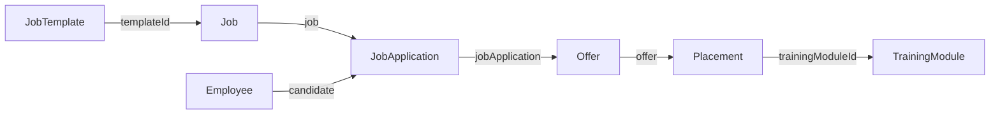
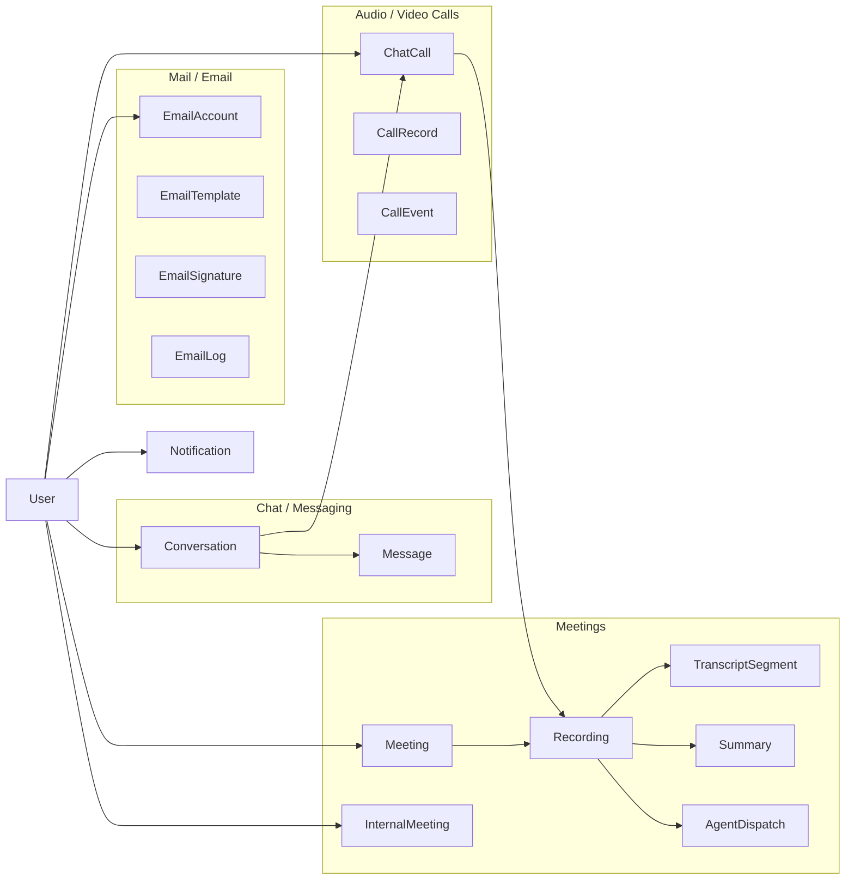
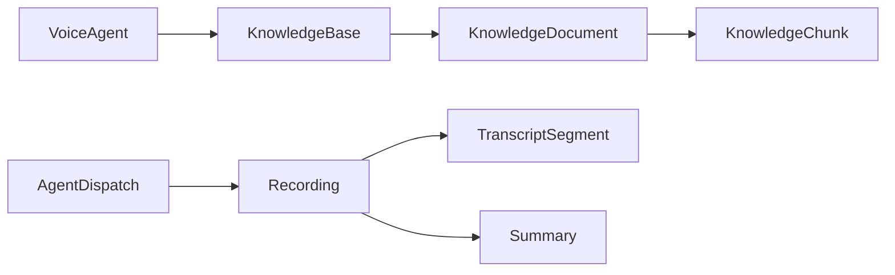

# Dharwin One — Database Model Relationship Report

**Generated from:** `dharwinone_backend/src/models/` (78 Mongoose models)  
**Scope:** User relationships, communication systems, file storage, and user deletion impact analysis

---

## Table of Contents

1. [Architecture Overview](#1-architecture-overview)
2. [All Models Inventory](#2-all-models-inventory)
3. [User Model — Complete Relationship Analysis](#3-user-model--complete-relationship-analysis)
4. [Communication System Analysis](#4-communication-system-analysis)
5. [Relationship Maps](#5-relationship-maps)
6. [Master Relationship Tables](#6-master-relationship-tables)
7. [User Deletion Impact Analysis](#7-user-deletion-impact-analysis)
8. [Architecture Issues & Recommendations](#8-architecture-issues--recommendations)
9. [Final Summaries](#9-final-summaries)

---

## 1. Architecture Overview

Dharwin One is a **multi-tenant HR + ATS + LMS + PM + Communications + AI** platform built on MongoDB/Mongoose. Relationships are implemented as **ObjectId foreign keys with `ref`** — there are no database-level FK constraints; integrity is enforced in application code only.

### Hub Models

| Hub | Role |
|-----|------|
| **User** | Identity, auth, tenant boundary, actor on almost every entity |
| **Employee** | Candidate/employee profile (stored in `candidates` collection — legacy name) |
| **Job** | ATS pipeline anchor |

### Important Notes

- **Employee** model → MongoDB collection `candidates` (legacy naming)
- **TeamGroup** is the Mongoose model name (`teamGroup.model.js`); **TeamMember** is in `team.model.js`
- `tenantId` → `User` is used as a tenant boundary (typically the org admin user)
- `index.js` exports only 20 of 78 models
- **File Storage** has no MongoDB model — it uses S3 paths (`file-storage/{userId}/`)

---

## 2. All Models Inventory

### Auth & Identity (5)

| Model | Collection | Purpose |
|-------|-----------|---------|
| User | `users` | Login identity, roles, tenant admin |
| Role | `roles` | RBAC permissions |
| Token | `tokens` | Auth/refresh/reset tokens |
| Impersonation | `impersonations` | Admin impersonation sessions |
| HrmDeviceToken | `hrmdevicetokens` | HRM mobile device tokens |

### HR / Workforce (10)

| Model | Collection | Purpose |
|-------|-----------|---------|
| Employee | `candidates` | Candidate/employee profile |
| Shift | `shifts` | Work shift definitions |
| Holiday | `holidays` | Holiday calendar |
| Position | `positions` | Job titles |
| TeamGroup | `teamgroups` | Team definitions |
| TeamMember | `teammembers` | Team ↔ Employee membership |
| TeamImportLog | `teamimportlogs` | Bulk team import audit |
| SkillRecommendation | `skillrecommendations` | AI skill suggestions |
| SavedHrContact | `savedhrcontacts` | Saved HR contacts per user |
| ApolloEnrichment | `apolloenrichments` | Apollo.io enrichment cache |

### ATS / Recruiting (16)

| Model | Collection | Purpose |
|-------|-----------|---------|
| Job | `jobs` | Job postings |
| JobTemplate | `jobtemplates` | Reusable job templates |
| JobApplication | `jobapplications` | Candidate applications |
| Offer | `offers` | Job offers |
| Placement | `placements` | Post-offer onboarding tracking |
| Meeting | `meetings` | ATS interview meetings (LiveKit) |
| RecruiterNote | `recruiternotes` | Standalone recruiter notes |
| RecruiterActivityLog | `recruiteractivitylogs` | Recruiter action audit |
| ExternalJob | `externaljobs` | Externally sourced jobs |
| ReferralAttribution | `referralattributions` | Sales/referral attribution |
| CandidateGroup | `candidategroups` | Grouped candidates |
| CandidateSopTemplate | `candidatesoptemplates` | SOP step templates |
| SopNotificationState | `sopnotificationstates` | SOP notification dedup |
| CallRecord | `callrecords` | Bolna voice call records |
| CallEvent | `callevents` | Bolna webhook event log |
| BolnaCandidateAgentSettings | `bolnacandidateagentsettings` | Bolna agent config |

### Education / LMS (12)

| Model | Collection | Purpose |
|-------|-----------|---------|
| Category | `categories` | Course categories |
| Student | `students` | Student profile (linked to User) |
| Mentor | `mentors` | Mentor profile (linked to User) |
| StudentGroup | `studentgroups` | Grouped students |
| TrainingModule | `trainingmodules` | Courses/training content |
| StudentQuizAttempt | `studentquizattempts` | Quiz submissions |
| StudentEssayAttempt | `studentessayattempts` | Essay submissions |
| StudentCourseProgress | `studentcourseprogresses` | Course completion tracking |
| Certificate | `certificates` | Issued certificates |
| LeaveRequest | `leaverequests` | Student leave requests |
| Attendance | `attendances` | Daily attendance |
| BackdatedAttendanceRequest | `backdatedattendancerequests` | Attendance corrections |

### Project Management (8)

| Model | Collection | Purpose |
|-------|-----------|---------|
| Project | `projects` | Projects |
| Sprint | `sprints` | Sprints within projects |
| Task | `tasks` | Tasks within sprints/projects |
| TaskBreakdownPreview | `taskbreakdownpreviews` | AI task breakdown preview cache |
| TaskBreakdownIdempotency | `taskbreakdownidempotencies` | AI breakdown idempotency keys |
| AssignmentRun | `assignmentruns` | AI candidate-to-task assignment runs |
| AssignmentRow | `assignmentrows` | Per-task assignment recommendations |
| AssignmentRunFeedback | `assignmentrunfeedbacks` | Feedback on assignment runs |

### Communications (10)

| Model | Collection | Purpose |
|-------|-----------|---------|
| Conversation | `conversations` | Chat conversations |
| Message | `messages` | Chat messages |
| ChatCall | `chatcalls` | In-app voice/video calls |
| InternalMeeting | `internalmeetings` | Internal team meetings |
| Notification | `notifications` | In-app notifications |
| EmailTemplate | `emailtemplates` | Email templates |
| EmailSignature | `emailsignatures` | Email signatures |
| EmailAccount | `emailaccounts` | Connected email accounts |
| EmailLog | `emaillogs` | Sent email log |
| CannedResponse | `cannedresponses` | Pre-written support responses |

### AI / Voice / Knowledge (12)

| Model | Collection | Purpose |
|-------|-----------|---------|
| VoiceAgent | `voiceagents` | Voice AI agent config |
| KnowledgeBase | `knowledgebases` | KB per voice agent |
| KnowledgeDocument | `knowledgedocuments` | Uploaded KB documents |
| KnowledgeChunk | `knowledgechunks` | Vectorized document chunks |
| KbQueryCache | `kbquerycaches` | Cached KB query results |
| Recording | `recordings` | Meeting/call recordings |
| TranscriptSegment | `transcriptsegments` | AI transcripts |
| Summary | `summaries` | AI meeting summaries |
| SummaryDeadLetter | `summarydeadletters` | Failed summary processing queue |
| AgentDispatch | `agentdispatches` | AI agent dispatch jobs |
| ChatbotConfig | `chatbotconfigs` | Chatbot settings per admin |
| ConversationMemory | `conversationmemories` | Chatbot session memory |

### Support (2)

| Model | Collection | Purpose |
|-------|-----------|---------|
| SupportTicket | `supporttickets` | Support tickets |
| SupportCameraInvite | `supportcamerainvites` | Camera access invites |

### Audit & Infrastructure (3)

| Model | Collection | Purpose |
|-------|-----------|---------|
| ActivityLog | `activitylogs` | General activity audit |
| AuditEvent | `auditevents` | Security/compliance audit |
| ProcessedWebhookEvent | `processedwebhookevents` | Webhook idempotency |

### Models With No Foreign Key References

`Role`, `Shift`, `Holiday`, `Position`, `Category`, `ApolloEnrichment`, `CallEvent`, `ProcessedWebhookEvent`, `EmailLog`, `CandidateSopTemplate`

---

## 3. User Model — Complete Relationship Analysis

### User Model Hub Position

`User` is the **central identity and tenancy hub**. Nearly every domain connects to it as:

- **Login identity** (Student, Mentor profile extensions)
- **Actor/auditor** (`createdBy`, `performedBy`, `resolvedBy`)
- **Assignment target** (`assignedTo`, `assignedRecruiter`)
- **Tenant boundary** (`adminId`, `tenantId` → another User, typically the org admin)
- **Self-referential hierarchy** (`adminId`, `tenantId` on User itself)

### Self-References

| Field | Type | Purpose |
|-------|------|---------|
| `adminId` | Many-to-One → User | Org hierarchy — user belongs to an admin |
| `tenantId` | Many-to-One → User | Tenant boundary (mirrors adminId during migration) |

### Key Relationship Chains (Indirect)

| Chain | Path |
|-------|------|
| LMS pipeline | User → Student → TrainingModule → StudentQuizAttempt |
| ATS pipeline | User → Employee → JobApplication → Offer → Placement → TrainingModule |
| Voice AI pipeline | User → VoiceAgent → KnowledgeBase → KnowledgeDocument → KnowledgeChunk |
| Meeting AI | User → Meeting → Recording → TranscriptSegment / Summary |
| PM assignment | User → Project → AssignmentRun → AssignmentRow → Task + Employee |
| Chat | User → Conversation → Message / ChatCall → Recording |
| Team org chart | User → TeamGroup → TeamMember → Employee |

### Models Completely Isolated From User

- `ProcessedWebhookEvent`
- `ApolloEnrichment`
- `CandidateSopTemplate`

---

## 4. Communication System Analysis

Communications span **7 subsystems** — there is no single "Communication" collection.

### Subsystems

| Subsystem | Models | User Connection |
|-----------|--------|-----------------|
| **Mail** | EmailAccount, EmailTemplate, EmailSignature, EmailLog | Direct (except EmailLog) |
| **Chat** | Conversation, Message | Direct |
| **In-app calls** | ChatCall | Direct |
| **ATS meetings** | Meeting | Direct (creator/tenant) |
| **Internal meetings** | InternalMeeting | Direct (creator) |
| **Outbound AI calls** | CallRecord, CallEvent | Direct (creator) |
| **Notifications** | Notification | Direct |
| **Support** | SupportTicket, CannedResponse, SupportCameraInvite | Direct |
| **File storage** | S3 service + embedded attachments | Direct (path-based) |
| **AI comms** | Recording, TranscriptSegment, Summary, AgentDispatch | Indirect (tenant) |

### Communication Data Flows

| Flow | Path | What It Enables |
|------|------|-----------------|
| Chat message | User → Conversation → Message (+ S3 attachment) → Notification | Real-time messaging with file sharing |
| In-app call | User → ChatCall → LiveKit → Recording → TranscriptSegment → Summary | Audio/video calls with optional AI transcription |
| ATS interview | User → Meeting → LiveKit → Recording → AI pipeline | Scheduled interviews with recording + AI notes |
| Internal meeting | User → InternalMeeting → LiveKit → Recording | Team meetings separate from ATS |
| Outbound AI call | User → CallRecord → Bolna API → CallEvent → Notification | Automated candidate screening calls |
| Connected email | User → EmailAccount → External provider | Read/send mail via OAuth |
| System email | App → SMTP → EmailLog (by address) | Password reset, offer emails, invites |
| File upload | User → S3 `file-storage/{userId}/` | Personal file manager |
| Chat attachment | User → Message.attachments[] → S3 | Files shared inside conversations |
| Support files | User → SupportTicket.attachments[] → S3 | Evidence attached to tickets |

### File Storage Architecture

There is **no dedicated File MongoDB model**. Files are stored across three patterns:

| Pattern | Location | Examples |
|---------|----------|---------|
| **S3 path-based** | `file-storage/{userId}/{folder}/` | Personal file cabinet API |
| **Embedded attachments** | Subdocuments with `url`, `key`, `mimeType` | Message, SupportTicket, Employee.documents |
| **Recording media** | `Recording.filePath`, `Recording.s3Key` | LiveKit egress to S3 |

Embedded file fields also exist on: `User.profilePicture`, `Student.documents`, `Student.profileImage`, `Employee.documents`, `Conversation.avatar`, `TrainingModule.coverImage`, `TrainingModule.playlist[].videoFile`

---

## 5. Relationship Maps

### User Hub Map

```mermaid
graph TB
    User((User Hub))

    subgraph Identity["1:1 Profile Extensions"]
        Student
        Mentor
    end

    subgraph ATS["ATS / HR"]
        Employee
        Job
        JobApplication
        Offer
        Placement
        Meeting
        CallRecord
    end

    subgraph Comms["Communications"]
        Conversation
        Message
        ChatCall
        EmailAccount
        Notification
        InternalMeeting
        Recording
    end

    subgraph Ops["Operations"]
        Project
        Task
        SupportTicket
        Attendance
        ActivityLog
    end

    User --> Student
    User --> Mentor
    User --> Employee
    User --> Job
    User --> Conversation
    User --> EmailAccount
    User --> Project
    User --> Token
    User --> Role
```

### ATS Pipeline

### Communication Architecture

### Voice AI Pipeline

---

## 6. Master Relationship Tables

### Table A: User → All Connected Models

| Model Name | Connected Model | Relationship Type | Direct / Indirect | Purpose | Detailed Explanation |
|---|---|---|---|---|---|
| User | Role | Many-to-Many (FK array `roleIds[]`) | Direct | RBAC | User holds multiple role ObjectIds for permission checks |
| User | User | Many-to-One self-ref (`adminId`, `tenantId`) | Direct | Multi-tenancy | Every user belongs to an org admin; deleting tenant admin breaks all children |
| User | Token | One-to-Many FK (`user`) | Direct | Authentication | Refresh/reset/verify tokens per user |
| User | Impersonation | One-to-Many FK (`adminUser`, `impersonatedUser`) | Direct | Admin impersonation | Tracks admin sessions acting as another user |
| User | HrmDeviceToken | One-to-Many FK (`issuedBy`, `revokedBy`) | Direct | HRM device auth | Windows HRM agent device tokens |
| User | Student | One-to-One FK (`user`, unique) | Direct | LMS identity | One student profile per login user |
| User | Mentor | One-to-One FK (`user`) | Direct | Mentor identity | Mentor profile for training assignments |
| User | Employee | One-to-Many FK (multiple fields) | Direct | ATS/HR profile | `owner`, `adminId`, `tenantId`, recruiters, managers, referral fields |
| User | Job | One-to-Many FK (`createdBy`, `tenantId`, `bookmarks[].user`) | Direct | Job postings | Creator + tenant scoping + bookmarks |
| User | JobTemplate | One-to-Many FK (`createdBy`) | Direct | Template authorship | Reusable job template creator |
| User | JobApplication | One-to-Many FK (`applicantUser`, `appliedBy`, `tenantId`) | Direct | Applications | Portal login + submitter tracking |
| User | Offer | One-to-Many FK (`createdBy`) | Direct | Offer audit | Who issued the offer |
| User | Placement | One-to-Many FK (lifecycle fields) | Direct | Placement lifecycle | createdBy, deferredBy, cancelledBy, referredByUserId |
| User | Meeting | One-to-Many FK (`createdBy`, `tenantId`) | Direct | Interview scheduling | ATS interviews; participants are string snapshots |
| User | ReferralAttribution | One-to-Many FK (agent fields) | Direct | Sales attribution | salesAgentUserId, assignedByUserId, revokedBy |
| User | RecruiterNote | One-to-Many FK (`recruiter`, `postedBy`) | Direct | Recruiter notes | Note authorship |
| User | RecruiterActivityLog | One-to-Many FK (`recruiter`) | Direct | Recruiter audit | Immutable action log |
| User | ExternalJob | One-to-Many FK (`savedBy`) | Direct | External jobs | Who saved external posting |
| User | CallRecord | One-to-Many FK (`createdBy`) | Direct | Bolna calls | User who triggered outbound AI call |
| User | TrainingModule | Indirect via Student/Mentor | Indirect | Course enrollment | No direct User FK on TrainingModule |
| User | StudentQuizAttempt | Indirect via Student | Indirect | Quiz history | User → Student → Attempt |
| User | StudentEssayAttempt | Mixed | Mixed | Essay grading | Indirect via Student; direct `reviewedBy` |
| User | Attendance | Mixed | Mixed | Attendance | Staff: `user` FK; Students: `student` → User |
| User | Project | Many-to-Many + FK | Direct | Project ownership | assignedTo[], createdBy |
| User | Sprint | One-to-Many FK (`createdBy`) | Direct | Sprint creation | |
| User | Task | Many-to-Many + FK | Direct | Task management | assignedTo[], createdBy, comments |
| User | Conversation | Many-to-Many embedded + `createdBy` | Direct | Chat threads | participants[].user |
| User | Message | One-to-Many FK (multiple) | Direct | Chat messages | sender, readBy[], reactions[], deletedBy |
| User | ChatCall | Many-to-Many FK | Direct | In-app calls | caller, participants[], roomJoinedUserIds[] |
| User | InternalMeeting | One-to-Many FK (`createdBy`) | Direct | Team meetings | Hosts stored as email strings |
| User | Recording | One-to-Many FK (`tenantId`) | Direct (tenant) | Recordings | Links via string meetingId |
| User | Notification | One-to-Many FK (`user`, `triggeredBy`) | Direct | In-app alerts | Recipient + actor |
| User | EmailAccount | One-to-Many FK (`user`) | Direct | Connected mailboxes | Gmail/Outlook/IMAP OAuth |
| User | EmailTemplate | One-to-Many FK (`user`) | Direct | Personal templates | |
| User | EmailSignature | One-to-Many FK (`user`) | Direct | Email signatures | |
| User | EmailLog | None (email string) | Weak indirect | System email audit | No userId FK |
| User | SupportTicket | One-to-Many FK (lifecycle) | Direct | Support workflow | createdBy, assignedTo, resolvedBy, closedBy |
| User | SupportCameraInvite | One-to-Many FK | Direct | Camera access | targetUserId, createdBy |
| User | VoiceAgent | One-to-Many FK (`createdBy`) | Direct | Voice AI config | |
| User | ChatbotConfig | One-to-Many FK (`adminId`) | Direct | Org chatbot | Per-admin settings |
| User | ConversationMemory | Compound unique (`userId`, `adminId`) | Direct | Chatbot memory | Session context per user+admin |
| User | ActivityLog | One-to-Many FK (`actor`) | Direct | General audit | entityId is String |
| User | AuditEvent | One-to-Many FK (`actor`) | Direct | Security audit | Historical — preserve actor |
| User | S3 File Storage | Path-based | Direct | Personal files | `file-storage/{userId}/` |
| User | Shift / Holiday / Position / Category | Indirect via profiles | Indirect | Reference data | Lookup tables |

### Table B: Communication Models

| Model Name | Connected Model | Relationship Type | Direct/Indirect to User | Purpose | Detailed Explanation |
|---|---|---|---|---|---|
| EmailAccount | User | Many-to-One FK (`user`, required) | Direct | Mailbox ownership | OAuth tokens for Gmail/Outlook/IMAP |
| EmailTemplate | User | Many-to-One FK (`user`) | Direct | Personal templates | Reusable email bodies |
| EmailSignature | User | Many-to-One FK (`user`) | Direct | Signatures | HTML/text signature |
| EmailLog | (none) | Standalone | Weak indirect | System email audit | Logs by recipient address, no userId |
| Conversation | User | Many-to-Many embedded + `createdBy` | Direct | Chat container | Direct or group chats |
| Conversation | Message | One-to-Many FK | N/A | Message thread | All messages in one conversation |
| Message | User | Many-to-One (`sender`, required) | Direct | Message authorship | Exactly one sender per message |
| Message | User | Many-to-Many (`readBy[]`, `reactions[]`) | Direct | Read receipts | Who read/reacted |
| Message | Message | Self-ref (`replyTo`) | N/A | Threading | Reply chains |
| Message | Attachments (embedded S3) | Embedded subdoc | Direct via sender | File sharing | url, key, mimeType in message |
| ChatCall | Conversation | Many-to-One FK (required) | Indirect | Call context | Calls happen inside conversations |
| ChatCall | User | Many-to-One + Many-to-Many | Direct | Call participants | Audio/video via LiveKit |
| ChatCall | Recording | Many-to-One FK (`recordingId`) | Indirect | Call recording | Optional LiveKit egress |
| Meeting | User | Many-to-One (`createdBy`, `tenantId`) | Direct | Interview scheduling | ATS interviews |
| Meeting | Employee | String snapshot (`candidate.id`) | Indirect | Candidate context | Denormalized, not a real FK |
| Meeting | Recording | String link (`meetingId`) | Indirect | Interview recording | Loose string association |
| InternalMeeting | User | Many-to-One (`createdBy`) | Direct | Team meetings | Non-ATS meetings |
| Recording | User | Many-to-One (`tenantId`) | Direct (tenant) | Tenant scoping | Org-level recording access |
| Recording | TranscriptSegment | Bidirectional One-to-One-ish | Indirect | AI transcript | Both sides hold refs |
| Recording | Summary | Bidirectional One-to-One-ish | Indirect | AI summary | Both sides hold refs |
| Recording | S3 | `filePath`, `s3Key` | Indirect | Media storage | Actual video/audio in S3 |
| CallRecord | User | Many-to-One (`createdBy`, nullable) | Direct | Outbound AI calls | Bolna voice agent calls |
| CallRecord | Employee, Job | Many-to-One FK | Indirect | Call context | Candidate/job context |
| CallRecord | CallEvent | String (`executionId`) | N/A | Event stream | No ObjectId FK |
| Notification | User | Many-to-One (`user`, `triggeredBy`) | Direct | Alerts | In-app + email triggers |
| Notification | Any model | Polymorphic (`relatedEntity`) | Indirect | Deep links | type + id without hard FK |
| SupportTicket | User | Many-to-One (lifecycle) | Direct | Support workflow | Full ticket lifecycle |
| SupportTicket | Employee | Many-to-One (`candidate`) | Indirect | Candidate context | Optional candidate link |
| SupportTicket | Attachments (embedded) | Embedded subdoc | Direct via creator | File evidence | S3 files in ticket/comments |
| CannedResponse | User | Many-to-One (`createdBy`) | Direct | Support macros | Pre-written replies |
| SupportCameraInvite | User | Many-to-One | Direct | Camera access | Remote camera request |
| S3 File Storage | User | Path prefix | Direct | Personal files | No MongoDB model |

---

## 7. User Deletion Impact Analysis

### Critical Context

1. **MongoDB has zero FK constraints** — no database constraint errors on hard delete
2. **Current implementation** (`user.service.js` → `deleteUserById`) performs **hard delete** with **partial cascade**
3. **`User.status`** supports `'deleted'` for soft delete, but `deleteUserById` does not use it
4. **S3 files** are not cleaned up on user deletion

### What `deleteUserById` Currently Cascades

| Deleted | Trigger |
|---------|---------|
| Student + Attendance, LeaveRequest, BackdatedAttendanceRequest, StudentCourseProgress, StudentQuizAttempt, StudentEssayAttempt, Certificate | `Student.user = userId` |
| Employee + JobApplications (for those candidates) | `Employee.owner = userId` OR `Employee.email = user.email` |
| JobApplications | `appliedBy = userId` |
| EmailAccount, Notification (recipient), Mentor, Impersonation, Token | Direct user FK |
| ConversationMemory refs | Cleared (not deleted) |
| Pinecone embeddings | Best-effort delete |

### What Is NOT Cascaded (Will Orphan)

Conversation, Message, ChatCall, Meeting, InternalMeeting, Recording, Project, Task, Offer, Placement, SupportTicket, ActivityLog, Job (as creator), Employee (as recruiter/manager reference), S3 files, and 40+ other models.

### Deletion Impact Table

| Affected Model | Dependency on User | Severity | What Breaks | Recommended Strategy | Recommended Constraint |
|---|---|---|---|---|---|
| Token | `user` (required) | **Critical** | Orphaned auth tokens | CASCADE delete (done) | ON DELETE CASCADE |
| Student | `user` (required, unique) | **Critical** | LMS profile orphaned | CASCADE delete (done) | ON DELETE CASCADE |
| Student children | via Student | **Critical** | LMS data orphaned | CASCADE delete (done) | ON DELETE CASCADE |
| Employee (as owner) | `owner` (required) | **Critical** | ATS data inconsistent | CASCADE delete (partial) | ON DELETE CASCADE |
| JobApplication | `appliedBy`, `applicantUser`, `tenantId` | **High** | Orphaned applications | CASCADE for appliedBy; SET NULL for applicantUser | Mixed |
| EmailAccount | `user` (required) | **High** | OAuth tokens remain | CASCADE delete (done) | ON DELETE CASCADE |
| Notification (recipient) | `user` (required) | **Medium** | Dead notifications | CASCADE delete (done) | ON DELETE CASCADE |
| Mentor | `user` | **High** | TrainingModule dead refs | CASCADE delete; $pull from TrainingModule | ON DELETE CASCADE |
| Impersonation | `adminUser`, `impersonatedUser` | **Medium** | Stale records | CASCADE delete (done) | ON DELETE CASCADE |
| ConversationMemory | `userId` (required) | **High** | Dead memory rows | CASCADE delete (currently only clears refs) | ON DELETE CASCADE |
| Conversation | `participants[].user`, `createdBy` | **High** | Ghost participants | Soft-delete OR pull from participants | SET NULL / array pull |
| Message | `sender` (required), `readBy[]`, `reactions[]` | **High** | Broken populate | Preserve — SET NULL + snapshot name | SET NULL + snapshot |
| ChatCall | `caller`, `participants[]` | **High** | Call history broken | Preserve — SET NULL + snapshot | SET NULL |
| Meeting | `createdBy`, `tenantId` | **High** | Interview records lose creator | Preserve — SET NULL | SET NULL |
| InternalMeeting | `createdBy` | **Medium** | Meeting history loses creator | Preserve — SET NULL | SET NULL |
| Recording | `tenantId` | **Medium** | Tenant queries break if admin deleted | Preserve recordings | RESTRICT for tenant admin |
| TranscriptSegment / Summary | via Recording | **Low** | AI data survives | Preserve | No action |
| CallRecord | `createdBy` (nullable) | **Medium** | Call history loses initiator | Preserve — SET NULL | SET NULL |
| CallEvent | none | **Low** | Unaffected | Preserve | No action |
| Job | `createdBy`, `tenantId`, `bookmarks[]` | **High** | Jobs lose creator | SET NULL; pull bookmarks | SET NULL |
| Offer | `createdBy` | **High** | Audit trail loses creator | Preserve with snapshot | SET NULL + snapshot |
| Placement | lifecycle user fields | **High** | Onboarding audit broken | Preserve with snapshots | SET NULL |
| Employee (as recruiter/manager) | assignment fields | **High** | Candidates lose staff refs | SET NULL on all assignment fields | SET NULL |
| Project / Sprint / Task | `createdBy`, `assignedTo[]` | **High** | PM data loses ownership | SET NULL; pull from arrays | SET NULL |
| SupportTicket | lifecycle user fields | **High** | Support history broken | Preserve — SET NULL + snapshots | SET NULL |
| ActivityLog | `actor` (required) | **Medium** | Audit shows dead actor | Preserve — snapshot in metadata | RESTRICT / snapshot |
| AuditEvent | `actor` | **Medium** | Security audit integrity | Preserve forever | RESTRICT |
| ReferralAttribution | agent user fields | **High** | Commission data wrong | Preserve — SET NULL + snapshot | SET NULL |
| S3 File Storage | path prefix | **High** | Orphaned S3 objects | CASCADE S3 delete | Application CASCADE |
| Message.attachments | via sender | **Medium** | Orphaned S3 objects | Delete S3 keys on cascade | Application CASCADE |
| User (children) | `adminId`, `tenantId` | **Critical** | All org users orphaned | RESTRICT admin delete | RESTRICT |
| TrainingModule | Student/Mentor arrays | **Medium** | Dead enrollment IDs | $pull dead IDs | Application cleanup |
| VoiceAgent / KB chain | `createdBy` | **Medium** | AI config loses creator | SET NULL or reassign | SET NULL |
| ChatbotConfig | `adminId` | **High** | Org chatbot orphaned | CASCADE or reassign | CASCADE |
| HrmDeviceToken | `issuedBy`, `revokedBy` | **Medium** | Device tokens remain | CASCADE delete | CASCADE |
| SavedHrContact | `userId` (required) | **Low** | Personal contacts orphaned | CASCADE delete | CASCADE |
| TaskBreakdownPreview/Idempotency | `userId` (required) | **Low** | Cache rows orphaned | CASCADE delete | CASCADE |

### Deletion Strategy Recommendations

#### Hard-delete (CASCADE) — user-owned, no historical value

Token, EmailAccount, Notification (recipient), SavedHrContact, HrmDeviceToken, TaskBreakdownPreview, TaskBreakdownIdempotency, Student profile + all LMS children, Employee (when owner), ConversationMemory rows

#### Soft-delete (preferred for most users)

Set `User.status = 'deleted'` instead of `deleteOne()`. Preserves referential display across chat, meetings, audit, ATS. Mask PII (email, name) but keep `_id` for populate.

#### SET NULL — preserve parent record, lose user link

Message.sender, ChatCall.caller, Meeting.createdBy, Job.createdBy, Offer.createdBy, Employee.assignedRecruiter, Project/Task assignedTo, SupportTicket.assignedTo

#### Preserve with snapshot — legal/audit requirements

ActivityLog, AuditEvent, Offer, Placement, ReferralAttribution, CallRecord — store `actorName`/`createdByName` at write time

#### RESTRICT — block deletion

Tenant admin User (if child users exist), User referenced as `tenantId` on active Jobs/Meetings

#### S3 cleanup (application-level CASCADE)

`file-storage/{userId}/`, Message attachment keys, orphaned profile pictures

---

## 8. Architecture Issues & Recommendations

| Issue | Severity | Detail | Recommendation |
|-------|----------|--------|----------------|
| Incomplete delete cascade | **Critical** | `deleteUserById` leaves 50+ models orphaned | Implement full cascade spec or switch to soft-delete |
| No soft-delete path | **High** | `status: 'deleted'` exists but unused in delete service | Use soft-delete as default; hard-delete only for GDPR |
| No S3 cleanup on user delete | **High** | `file-storage/{userId}/` persists | Add S3 prefix delete to cascade |
| Tenant admin deletion unguarded | **Critical** | Deleting admin orphans all children | Add RESTRICT check before admin delete |
| Employee lacks `userId` FK | **High** | Unlike Student/Mentor, no clean 1:1 login link | Add `userId` FK on Employee |
| Meeting participants are strings | **Medium** | `candidate.id` not `ref: 'Employee'` | Convert to FK with denormalized cache fields |
| Bidirectional Recording ↔ Transcript/Summary | **Medium** | Sync drift risk | Pick one direction for ownership |
| EmailLog has no userId | **Low** | Cannot correlate emails to users | Add optional `userId` or `triggeredByUserId` |
| File storage has no MongoDB model | **Medium** | Files scattered across S3 + embedded fields | Consider unified FileRegistry model |
| RecruiterNote has no candidate FK | **Medium** | Parallel note systems | Add `candidateId` or deprecate standalone model |
| ConversationMemory not deleted | **Medium** | Only refs cleared on user delete | CASCADE delete ConversationMemory rows |
| Employee collection named `candidates` | **Medium** | Confusing legacy naming | Migrate collection to `employees` |
| `index.js` exports only 20 models | **Low** | Incomplete barrel file | Complete export or remove barrel |
| `tenantId` duplicates `adminId` | **Low** | Transitional migration debt | Complete backfill and consolidate |

---

## 9. Final Summaries

### User Model Relationships — Summary

- **Direct FK connections:** 45+ models reference User across 80+ fields
- **Indirect connections:** 20+ models reachable via Student, Mentor, Employee, Recording, VoiceAgent chains
- **Isolated from User:** ProcessedWebhookEvent, ApolloEnrichment, CandidateSopTemplate (3 models)
- **Self-references:** User.adminId, User.tenantId
- **Hub role:** User is identity, actor, assignee, tenant boundary, and notification recipient for the entire platform

### Communication System Relationships — Summary

| Subsystem | Models | User Connection | Storage |
|-----------|--------|-----------------|---------|
| Mail | EmailAccount, EmailTemplate, EmailSignature, EmailLog | Direct (except EmailLog) | OAuth in MongoDB; mail in external provider |
| Chat | Conversation, Message | Direct | MongoDB + S3 attachments |
| In-app calls | ChatCall | Direct | LiveKit + optional Recording |
| ATS meetings | Meeting | Direct (creator/tenant) | LiveKit + Recording + AI |
| Internal meetings | InternalMeeting | Direct (creator) | LiveKit + Recording |
| Outbound AI calls | CallRecord, CallEvent | Direct (creator) | Bolna + external URL |
| Notifications | Notification | Direct | MongoDB + polymorphic links |
| Support | SupportTicket, CannedResponse, SupportCameraInvite | Direct | MongoDB + S3 attachments |
| File storage | S3 service + embedded attachments | Direct (path-based) | S3 only |
| AI comms | Recording, TranscriptSegment, Summary, AgentDispatch | Indirect (tenant) | S3 + MongoDB |

### Relationship Type Legend

| Type | Description |
|------|-------------|
| **Many-to-One (FK)** | Child holds parent's ObjectId — most common pattern |
| **One-to-One (FK)** | e.g., Student.user, Offer.jobApplication |
| **Many-to-Many (FK array)** | e.g., User.roleIds[], TrainingModule.students[] |
| **Self-reference** | User, Message, ReferralAttribution |
| **Embedded FK** | Subdocument arrays with ObjectId refs |
| **Polymorphic** | ObjectId/String without `ref`, resolved by type field |
| **Denormalized snapshot** | Copied data (Meeting participants), not a true FK |
| **String association** | Loose link by string ID (Recording.meetingId, CallEvent.executionId) |

---

*Report based on source analysis of all 78 model files in `dharwinone_backend/src/models/` and `user.service.js` deletion logic.*
