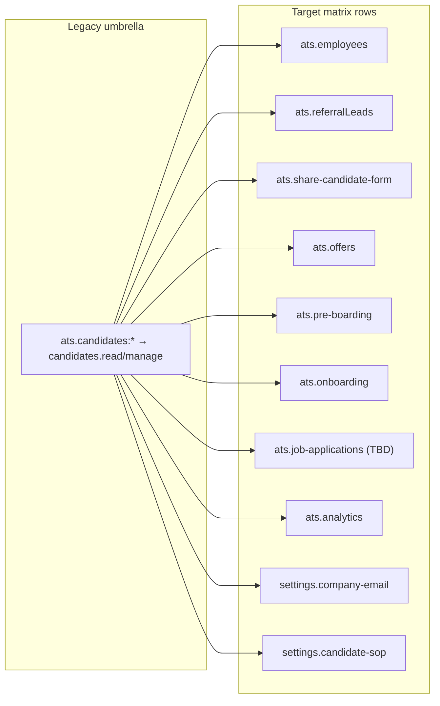

# RBAC: Dispersing Legacy `ats.candidates` Permissions

**Status:** Planning  
**Last updated:** 2026-05-27  
**Related:** [RBAC_HARDCODED_SCOPE_AUDIT.md](./RBAC_HARDCODED_SCOPE_AUDIT.md)

---

## Summary

The **ATS → Candidates** row in the user role matrix (`ats.candidates:*`) is a legacy umbrella permission. It still gates APIs, aliases, and controller scope logic for many unrelated features—even though the matrix already has dedicated rows for most of those pages.

This document maps every remaining `candidates.*` dependency to its **target matrix row and page**, and defines a phased migration to retire the Candidates row without breaking existing roles.

---

## Problem statement

Granting **Candidates → View/Create/Edit/Delete** today effectively grants access to:

- Employee directory (partially migrated to **Employees**)
- Referral leads
- Share candidate form
- Offers & placement
- Pre-boarding (placements API)
- Job applications (recruiter)
- ATS analytics (via alias)
- Settings: company email, employee SOP (via alias)
- Positions dropdowns, generic uploads, PM assistant, teams photos, notification audit, and more

Admins cannot assign **page-scoped** access until route guards, aliases, and controller checks use the correct resource keys.

---

## Architecture (current vs target)



### Derivation rule

Matrix strings like `ats.jobs:view,create` derive to API keys via `deriveApiPermissions()` in `src/services/permission.service.js`:

- `view` → `{resource}.read`
- `create|edit|delete` → `{resource}.create|edit|delete` and `{resource}.manage`

Resource name = segment after the first dot (e.g. `ats.referralLeads:view` → `referralLeads.read`).

### Alias layer

`src/config/permissions.js` (`permissionAliases`) expands route requirements. Many entries still list `candidates.read` or `candidates.manage` as back-compat grants—those must be removed **per phase** after role DB migration.

---

## Candidates vs Employees (terminology)

| | **Candidates (legacy)** | **Employees (new)** |
|---|---|---|
| Matrix row | ATS → **Candidates** | ATS → **Employees** |
| Domain keys | `ats.candidates:*` | `ats.employees:*` |
| API keys | `candidates.read/manage` (+ granular write via aliases) | `employees.read/create/edit/delete/manage` |
| Nav | Legacy path `/ats/candidates` redirects; no separate sidebar item | `/ats/employees` |
| Intended scope | Pre-hire + HR pipeline umbrella | HR employee directory (list, CRUD, import/export) |

**Entity model:** All records live in the MongoDB `candidates` collection; “Candidate” as a user role is a legacy name for the employee-facing role—not a separate permission concept.

---

## Full dispersion map

| Page / feature | Matrix row | Nav path | Primary API / routes | Current gate | Target API keys |
|---|---|---|---|---|---|
| Employee directory | `ats.employees` ✅ | `/ats/employees` | `employee.route.js` | `employees.*` + `candidates.*` backstop | **Phase 0 done** — remove backstop in Phase 7 |
| Referral leads | `ats.referralLeads` ✅ | `/ats/referral-leads` | `GET/POST …/employees/referral-leads*` | `candidates.read/manage` **only** | `referralLeads.read/manage` |
| Share candidate form | `ats.share-candidate-form` ✅ | `/ats/share-candidate-form` | `auth.route.js` invitation; public onboarding | `share-candidate-form.read` + `candidates.manage` alias | `share-candidate-form.*` only |
| Offers & placement | `ats.offers` ✅ | `/ats/offers-placement` | `offer.route.js` | `candidates.read/manage` | `offers.read/manage` |
| Pre-boarding | `ats.pre-boarding` ✅ | `/ats/pre-boarding` | `placement.route.js` | `candidates.read/manage` | `pre-boarding.read/manage` |
| Onboarding | `ats.onboarding` ✅ | `/ats/onboarding` | `PATCH …/joining-date` etc. | `onboarding.manage` OR `candidates.manage` | `onboarding.manage` (+ `employees.edit` where appropriate) |
| Job applications (recruiter) | ❌ **No row** | (Jobs UI) | `jobApplication.route.js` | `candidates.read/manage` | **Decision:** new `ats.job-applications` OR `jobs.read/manage` |
| My applications (self) | N/A | `/ats/my-applications` | `GET …/my-applications` | Auth only | No matrix row |
| ATS analytics | `ats.analytics` ✅ | `/ats/analytics` | `atsAnalytics.route.js` | Alias via `candidates.read/manage` | `analytics.read` / `ats.analytics:view` |
| Interview employee picklist | `ats.interviews` ✅ | `/ats/interviews` | Cross-feature reads | `candidates.read` alias includes `interviews.read` | Keep cross-grant or replace with explicit `employees.read` on interview roles |
| Settings: Company email | `settings.company-email` ✅ | Settings | Company email roster routes | Alias: `candidates.manage` | `company-email.*` |
| Settings: Employee SOP | `settings.candidate-sop` ✅ | Settings | SOP template CRUD | Alias: `candidates.manage` | `candidate-sop.*` |
| Training positions dropdown | `training.positions` ✅ | Training | `position.route.js` | Alias: `candidates.read/manage` | `positions.*` + training/students only |
| Generic S3 upload | N/A | Many | Upload middleware | `uploads.document` includes `candidates.manage` | Feature-specific manage keys only |
| PM assistant | `project.*` | PM UI | `pmAssistant.route.js` | Requires `candidates.read` | `employees.read` or `teams.read` |
| Teams profile photos | `project.teams` | Teams | `team.controller.js` / `team.service.js` | `candidates.read` in service | `teams.read` or `employees.read` |
| Notification admin audit | ❌ none | Admin | `notification.route.js` | `candidates.manage` | Dedicated admin permission |
| Sales agent attribution | Partial | Referral leads | `candidates.manageSalesAgentAttribution` | Separate derived keys | Move under `referralLeads.*` |

---

## Legacy touchpoints (inventory)

### Route files — direct `candidates.*` gates

| File | Notes |
|---|---|
| `src/routes/v1/employee.route.js` | Employees CRUD + **referral-only** middleware + joining/resign dates |
| `src/routes/v1/jobApplication.route.js` | All recruiter application CRUD |
| `src/routes/v1/offer.route.js` | All offer endpoints |
| `src/routes/v1/placement.route.js` | Pre-boarding placements |
| `src/routes/v1/notification.route.js` | Admin audit log |
| `src/routes/v1/pmAssistant.route.js` | PM tools |
| `src/routes/v1/position.route.js` | Indirect via alias |

### Alias backdoors (`src/config/permissions.js`)

| Alias key | Still grants via `candidates.*` |
|---|---|
| `employees.create/edit/delete` | `candidates.manage` |
| `candidates.read` | Bundles `referralLeads.read`, interviews cross-grant |
| `share-candidate-form.read` | `candidates.manage` |
| `positions.read/manage` | `candidates.read/manage` |
| `ats.analytics` | `candidates.read/manage` |
| `offers.read/manage` | `candidates.read/manage` |
| `company-email.*` / `candidate-sop.*` | `candidates.manage` |
| `uploads.document` | `candidates.manage` |
| `placement.audit` / `preboarding.override` | `candidates.manage` |

### Controller / service scope

| File | Pattern |
|---|---|
| `src/controllers/employee.controller.js` | `canManageCandidates`, `canViewAllEmployees`, list scoping |
| `src/services/referralLeads.service.js` | Org-wide if `candidates.manage` OR `interviews.manage` |
| `src/services/employee.service.js` | `isOwnerOrAdmin` via manage flag |
| `src/services/team.service.js` | Profile photo gate |
| `src/services/pmAssistant.service.js` | Directory read |
| `src/controllers/placement.controller.js` | Override check |

### Frontend (~30 files)

Core:

- `shared/lib/roles-permissions.ts` — matrix sections (Candidates row still present)
- `shared/lib/route-permissions.ts` — path → prefix; legacy `ats.candidates:` aliases for employees and referral
- `shared/lib/permissions.ts` — semantic actions with `ats.candidates` backstop
- `shared/lib/candidate-permissions.ts` — legacy helpers

Features: referral-leads hooks/utils, settings SOP, `api/employees.ts`, PM assistant, create-project, etc.

---

## Guiding principles

1. **Atomic per resource** — one matrix row owns one nav page and its API surface.
2. **Route swap, then alias tighten** — change route guards first; keep legacy backstop for one release if needed.
3. **Frontend alias period** — keep `ats.candidates:` → target row aliases until DB roles are migrated.
4. **Scope ≠ permission** — view permission must not imply owner-only list scope (see Employees view-only fix: `canViewAllEmployees`).
5. **Partial grants** — 16 intentional partial-grant entries across 4 active roles; do not auto-expand on migration.

---

## Phased execution

### Phase 0 — Employees ✅ (shipped)

**Goal:** HR directory uses `ats.employees` with granular CRUD.

| Layer | Status |
|---|---|
| Backend routes | `canReadEmployees`, `canCreateEmployees`, `canEditEmployees`, `canDeleteEmployees` |
| List scope | `canViewAllEmployees` — view users see org-wide list |
| Frontend | `view_employees`, `create_employee`, `update_employee`, `delete_employee` |
| Legacy | `candidates.*` still accepted as backstop |

**Remaining for Phase 7:** Remove `candidates.manage` from `employees.create/edit/delete` aliases and employee route backstops.

---

### Phase 1 — Referral leads

**Why first:** Referral routes use `canReadCandidatesOnly` / `canManageCandidatesOnly`. Roles with `ats.referralLeads:*` but without `ats.candidates:*` are broken today.

| Task | File(s) |
|---|---|
| Swap route gates | `employee.route.js` → `requireAnyOfPermissions('referralLeads.read', 'candidates.read')` (then drop candidates) |
| Service scope | `referralLeads.service.js` — org-wide: `referralLeads.manage` OR `interviews.manage` |
| Aliases | Add `referralLeads.read/manage`; remove referral keys from `candidates.read` bundle |
| Sales agent keys | Re-home `manageSalesAgentAttribution` under referralLeads domain |
| Frontend | Semantic actions for referral; stop using `view_candidates` |
| Tests | Route + scope tests with referral-only role |
| DB script | Copy `ats.candidates:*` → `ats.referralLeads:*` where missing |

---

### Phase 2 — Offers & placement

| Task | File(s) |
|---|---|
| Route swap | `offer.route.js` → `offers.read` / `offers.manage` |
| Service scope | `offer.service.js` — align list scope with `offers.read` |
| Aliases | Remove `candidates.*` from `offers.read/manage` after migration |
| Frontend | `/ats/offers-placement` — `ats.offers:*` only |
| Audit | Resolve recruiter fork in analytics/offers scope per hardcoded scope audit |

---

### Phase 3 — Job applications (recruiter)

**Product decision required:**

| Option | When to choose |
|---|---|
| **A. New `ats.job-applications` row** | Recruiters manage applications without full job admin |
| **B. Fold into `ats.jobs`** | Applications always scoped to job owners; jobs view = applications view |

| Task | File(s) |
|---|---|
| Route swap | `jobApplication.route.js` |
| Matrix UI | Add row if Option A |
| Frontend | Jobs / application modals use new semantic actions |

---

### Phase 4 — Pre-boarding

| Task | File(s) |
|---|---|
| Route swap | `placement.route.js` → `pre-boarding.read/manage` |
| Special keys | `placement.audit`, `preboarding.override` alias from `pre-boarding.manage`, not `candidates.manage` |
| Controller | `placement.controller.js` override check |
| Frontend | Verify `/ats/pre-boarding` with pre-boarding-only role |
| Note | `meeting.route.js` `move-to-preboarding` stays on `interviews.manage` |

---

### Phase 5 — Onboarding

| Task | File(s) |
|---|---|
| Joining date | `employee.route.js` — drop `candidates.manage`; keep `onboarding.manage` + `employees.edit` |
| Resign date | `employees.edit` only (not onboarding) |
| Frontend | `/ats/onboarding` on `ats.onboarding:*` |
| Audit | Any onboarding-specific employee reads |

---

### Phase 6 — Settings & cross-cutting

Remove `candidates.*` from aliases:

- `company-email.*`, `candidate-sop.*`, `share-candidate-form.read`
- `ats.analytics`, `positions.read/manage`, `uploads.document`
- `employees.create/edit/delete` (after DB migration)

Also:

- `pmAssistant.route.js` → `employees.read`
- `team.service.js` → `teams.read` or `employees.read`
- `notification.route.js` admin audit → proper admin permission

---

### Phase 7 — Deprecate Candidates matrix row

1. DB audit: roles with only `ats.candidates:*` → map to granular rows (`scripts/audit-partial-grants.mjs`).
2. Remove **Candidates** from `PERMISSION_SECTIONS` in frontend `roles-permissions.ts` (or mark deprecated).
3. Remove frontend aliases: `ats.candidates:` from `EMPLOYEES_PATH_PREFIXES` and `ROUTE_PREFIX_ALIASES`.
4. Remove all `candidates.*` backstops from backend routes.
5. Tighten `candidates.read` alias — retain interviews cross-grant only if picklists still need it; prefer explicit `employees.read` on interview roles.

---

## Per-phase checklist

Use for every phase before merge:

- [ ] Grep inventory: `candidates.(read|manage|create|edit|delete)` in routes, controllers, services, frontend
- [ ] Route guard swap (primary = target resource; optional legacy backstop one release)
- [ ] Update `permissionAliases` and frontend `route-permissions.ts`
- [ ] Controller list scope audit (view ≠ owner-only)
- [ ] Role DB migration script for target row
- [ ] Route permission tests + one E2E path with target-only role
- [ ] Manual QA: role with **only** new row, **no** candidates
- [ ] Update this doc phase status

---

## Role DB migration rules

When copying `ats.candidates:*` to a target row:

| Source pattern | Target copy |
|---|---|
| `view` only | Target `view` only |
| `create,edit,delete` | Same write actions on target |
| Full bundle | Full bundle on target |
| Known partial grants | **Manual review** — do not auto-expand |

Suggested audit command (extend as needed):

```bash
node scripts/audit-partial-grants.mjs
```

---

## Recommended order

```
Phase 0 (done) → 1 Referral → 2 Offers → 4 Pre-boarding → 5 Onboarding
→ 3 Job applications (after product decision) → 6 Cross-cutting → 7 Remove Candidates row
```

Phases 1, 2, and 4 remove the most route-level `candidates.*` gates while using matrix rows already exposed in the UI.

---

## Key file reference

| Area | Path |
|---|---|
| Alias map | `src/config/permissions.js` |
| Derivation | `src/services/permission.service.js` |
| Route guards | `src/routes/v1/*.route.js` |
| Employee scope | `src/controllers/employee.controller.js` |
| Referral scope | `src/services/referralLeads.service.js` |
| Scope audit | `docs/RBAC_HARDCODED_SCOPE_AUDIT.md` |
| Matrix UI | `uat.dharwin.frontend/shared/lib/roles-permissions.ts` |
| Route access | `uat.dharwin.frontend/shared/lib/route-permissions.ts` |
| Semantic actions | `uat.dharwin.frontend/shared/lib/permissions.ts` |

---

## Open decisions

1. **Job applications:** new matrix row vs fold into Jobs (Phase 3).
2. **Interview picklists:** keep `candidates.read` ↔ `interviews.read` cross-alias or require explicit `employees.read` on interview roles.
3. **Notification admin audit:** which settings row or new permission owns it.
4. **Sales agent attribution:** sub-permission on Referral row vs separate flag.

---

## Changelog

| Date | Change |
|---|---|
| 2026-05-27 | Initial plan document |
